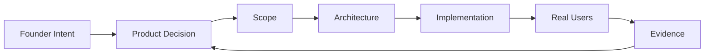

<div align="center">

# ZIA HUSSAIN

### Founder × Product Builder × Engineer

**I turn product uncertainty into software founders can actually launch, trust and build on.**

<br/>

[](https://zumetrix.com)
&nbsp;
[](https://www.linkedin.com/in/zia-hussain-404-/)
&nbsp;
[](https://www.upwork.com/freelancers/ziahussain1)

<br/>

`SAAS PRODUCTS` &nbsp; `PRODUCT RESCUE` &nbsp; `WEB` &nbsp; `MOBILE` &nbsp; `PAYMENTS` &nbsp; `SYSTEMS`

</div>

<br/>

---

## `01 / WHAT I DO`

<table>
<tr>
<td width="50%" valign="top">

### BUILD

Taking an idea from:

**uncertainty → decisions → MVP → launch**

I work across the product and engineering decisions required to turn an idea into something people can actually use.

</td>
<td width="50%" valign="top">

### RESCUE

Taking an existing product from:

**stuck → diagnosed → stable → moving again**

Inherited codebases, unfinished functionality, broken integrations, structural problems and products that are technically "almost done."

</td>
</tr>
<tr>
<td width="50%" valign="top">

### ENGINEER

Hands-on across:

**frontend · backend · mobile · data · APIs · payments**

I don't sit outside the implementation giving abstract product advice.

</td>
<td width="50%" valign="top">

### EVOLVE

Supporting products after version one through:

**iteration · architecture · integrations · stabilization**

Because launch isn't the end of the engineering problem.

</td>
</tr>
</table>

<br/>

---

## `02 / THE WAY I WORK`



<div align="center">

### The loop matters more than the stack.

</div>

Software is downstream of decisions.

Before asking **how do we build this?**, I usually care about questions like:

```text
Does this belong in version one?

What uncertainty are we actually trying to remove?

What happens when the happy path fails?

Are we solving a product problem or creating an engineering problem?

Should this be fixed, refactored or rebuilt?

What will today's shortcut cost six months from now?

What does the business need to learn before we build more?
```

<br/>

---

## `03 / PRODUCT PRINCIPLES`

<table>
<tr>
<td width="50%" valign="top">

### 01

**Version one should prove the business deserves version two.**

</td>
<td width="50%" valign="top">

### 02

**Technology should follow the product — not the other way around.**

</td>
</tr>

<tr>
<td width="50%" valign="top">

### 03

**Every feature has two costs: building it now and maintaining it later.**

</td>
<td width="50%" valign="top">

### 04

**A product can look almost finished and still be far from ready.**

</td>
</tr>

<tr>
<td colspan="2" align="center">

### 05

**Progress isn't only software written.  
It's uncertainty removed.**

</td>
</tr>
</table>

<br/>

---

## `04 / ENGINEERING SURFACE`

<div align="center">

### Core Product Engineering


### Mobile


### Data & Infrastructure


### Product Systems


<br/>

**The stack is a toolset. The product problem decides what gets used.**

</div>

<br/>

---

## `05 / WHERE I LIKE WORKING`

```text
┌─────────────────────────────────────────────────────────────────┐
│  IDEA                                                           │
│    ↓                                                            │
│  PRODUCT DECISIONS                                              │
│    ↓                                                            │
│  VERSION ONE                                                    │
│    ↓                                                            │
│  BUILD  ───────────────→  LAUNCH                                │
│    │                       │                                    │
│    │                       ↓                                    │
│    │                  REAL USAGE                                │
│    │                       │                                    │
│    ↓                       ↓                                    │
│  RESCUE  ←──────────  PROBLEMS / EVIDENCE                       │
│    │                                                            │
│    ↓                                                            │
│  STABILIZE → ITERATE → POST-LAUNCH ENGINEERING                  │
└─────────────────────────────────────────────────────────────────┘
```

That's the territory I'm interested in.

Not simply:

> “Can this feature be coded?”

More often:

> **“What does this product need next, and what's the right engineering decision behind it?”**

<br/>

---

## `06 / PROBLEMS I ENJOY`

<table>
<tr>
<td><code>01</code></td>
<td><strong>Turning broad founder ideas into focused version-one products</strong></td>
</tr>
<tr>
<td><code>02</code></td>
<td><strong>Removing unnecessary scope before it becomes expensive software</strong></td>
</tr>
<tr>
<td><code>03</code></td>
<td><strong>Taking over unfinished or inherited products</strong></td>
</tr>
<tr>
<td><code>04</code></td>
<td><strong>Finding why "almost finished" products still aren't launch-ready</strong></td>
</tr>
<tr>
<td><code>05</code></td>
<td><strong>Designing payments, subscriptions, authentication and integrations properly</strong></td>
</tr>
<tr>
<td><code>06</code></td>
<td><strong>Deciding whether something deserves a fix, refactor or rebuild</strong></td>
</tr>
<tr>
<td><code>07</code></td>
<td><strong>Moving prototypes toward dependable production software</strong></td>
</tr>
<tr>
<td><code>08</code></td>
<td><strong>Explaining technical decisions in business language founders can act on</strong></td>
</tr>
</table>

<br/>

---

## `07 / UNDER THE HOOD`

<details>
<summary><strong>Web product engineering</strong></summary>

<br/>

I work across modern SaaS/web product development using tools such as **React, Next.js, TypeScript, Node.js and Express**.

The focus isn't only screens and endpoints. I care about how application state, authentication, data, payments, permissions, integrations and business rules work together as one product.

</details>

<details>
<summary><strong>Mobile product engineering</strong></summary>

<br/>

For mobile products, I work primarily with **React Native + Expo**, including cross-platform product flows, authentication, backend integration, subscriptions and release/publishing considerations.

</details>

<details>
<summary><strong>Product rescue</strong></summary>

<br/>

Not every product needs a rewrite.

When taking over an existing system, the first job is understanding:

**what actually works · what only appears to work · what is structurally dangerous · what can survive · what should change**

The answer might be a targeted fix, stabilization, refactor, architecture change or selective rebuild.

</details>

<details>
<summary><strong>Low-code / no-code</strong></summary>

<br/>

I use platforms such as **Bubble and FlutterFlow** when they fit the product and business constraints.

No-code is neither automatically inferior nor automatically faster.

The question is whether the tool still makes sense for the product you're trying to create.

</details>

<details>
<summary><strong>Automation + AI</strong></summary>

<br/>

I work with **OpenAI integrations, Make, n8n, Zapier and Airtable** when automation or AI removes real operational/product friction.

AI is a capability inside the system — not the identity of every product.

</details>

<br/>

---

## `08 / BUILDING ZUMETRIX`

<div align="center">

### [Zumetrix Labs](https://zumetrix.com)

**Founder-led product engineering for serious software products.**

</div>

I'm building Zumetrix around a simple belief:

> ### Founders shouldn't have to choose between someone who understands the business and someone who understands the build.

My role crosses both sides:

```text
PRODUCT DIRECTION
        ×
TECHNICAL JUDGMENT
        ×
HANDS-ON ENGINEERING
        ×
FOUNDER COMMUNICATION
```

The goal isn't to become a factory that ships the most features.

It's to become exceptionally good at helping founders make and execute the product decisions that actually matter.

<br/>

---

## `09 / PUBLIC GITHUB ≠ ALL THE WORK`

Most of the products I build professionally live in:

`private repositories`  
`client organizations`  
`production infrastructure`  
`private databases`  
`commercial systems`

So I don't treat contribution counts as a proxy for engineering capability.

### GitHub is my engineering workspace — not my scoreboard.

As work becomes appropriate to open-source, useful pieces will appear here.

<br/>

---

## `10 / CURRENT SIGNAL`

```yaml
name: Zia Hussain

role:
  - Founder @ Zumetrix Labs
  - SaaS Product Builder
  - Product Engineer

working_on:
  - SaaS products
  - Product rescue
  - Web + mobile systems
  - Product architecture
  - Subscription products
  - Post-launch engineering

thinking_about:
  - What version one should actually contain
  - How software decisions affect the business
  - How products survive contact with real users
  - How AI changes building without replacing judgment

principle:
  "Build what the business needs to learn next."
```

<br/>

---

## `11 / CONNECT`

<div align="center">

### If you're building a serious software product, you'll usually find me here:

<br/>

[](https://www.linkedin.com/in/zia-hussain-404-/)

[](https://zumetrix.com)

[](https://www.upwork.com/freelancers/ziahussain1)

<br/><br/>

---

### Founder × Product × Engineering

**Building software is the implementation.  
Building the right product is the job.**

</div>
